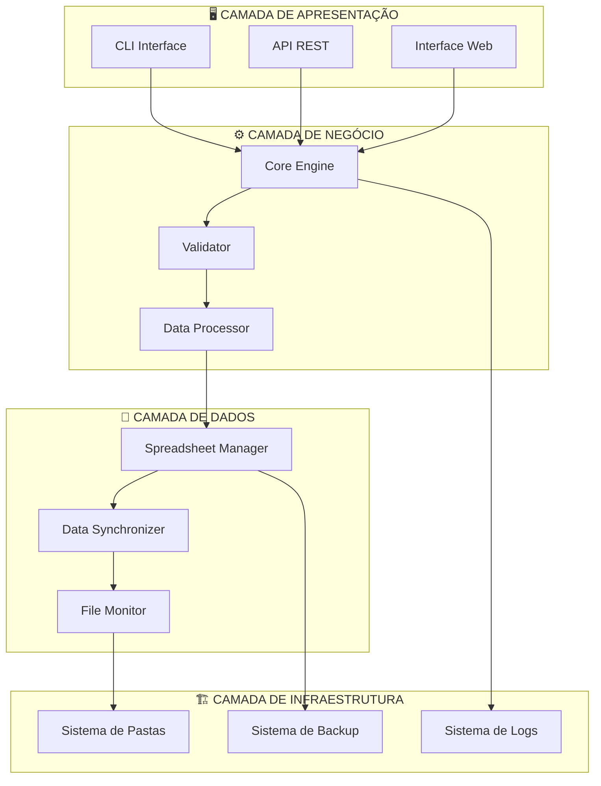

# FLUXOGRAMA DA ARQUITETURA DO PROJETO

## Visão Geral
Este fluxograma detalha a arquitetura completa do sistema de consolidação de planilhas, mostrando como cada componente interage e os 10 passos técnicos específicos do processo.

## ARQUITETURA EM CAMADAS COM FLUXO TÉCNICO



## FLUXOGRAMA DETALHADO DOS 10 PASSOS TÉCNICOS

```mermaid
flowchart TD
    START(["🚀 INÍCIO DO PROCESSO"]) --> STEP1
    
    %% PASSO 1: INICIALIZAÇÃO
    subgraph INIT["📁 PASSO 1: INICIALIZAÇÃO DO SISTEMA"]
        STEP1["1.1 Verificar estrutura de pastas"]
        STEP1 --> STEP1_2["1.2 Criar pastas ausentes"]
        STEP1_2 --> STEP1_3["1.3 Validar permissões"]
        STEP1_3 --> STEP1_4["1.4 Inicializar logs"]
    end
    
    %% PASSO 2: DESCOBERTA
    subgraph DISCOVERY["🔍 PASSO 2: DESCOBERTA DE PLANILHAS"]
        STEP2["2.1 Escanear pasta SUBORDINADAS"]
        STEP2 --> STEP2_2["2.2 Filtrar arquivos .xlsx/.xls"]
        STEP2_2 --> STEP2_3["2.3 Validar integridade"]
        STEP2_3 --> STEP2_4["2.4 Verificar dados válidos"]
        STEP2_4 --> STEP2_5["2.5 Registrar em log"]
    end
    
    %% PASSO 3: ANÁLISE
    subgraph ANALYSIS["📊 PASSO 3: ANÁLISE DE ESTRUTURA"]
        STEP3["3.1 Carregar planilhas"]
        STEP3 --> STEP3_2["3.2 Extrair cabeçalhos"]
        STEP3_2 --> STEP3_3["3.3 Mapear estilos"]
        STEP3_3 --> STEP3_4["3.4 Identificar fórmulas"]
        STEP3_4 --> STEP3_5["3.5 Catalogar elementos visuais"]
    end
    
    %% PASSO 4: BACKUP
    subgraph BACKUP_STEP["💾 PASSO 4: CRIAÇÃO DE BACKUP"]
        STEP4["4.1 Verificar planilha mestre"]
        STEP4 --> STEP4_2["4.2 Gerar nome com timestamp"]
        STEP4_2 --> STEP4_3["4.3 Copiar para pasta BACKUP"]
        STEP4_3 --> STEP4_4["4.4 Validar integridade"]
        STEP4_4 --> STEP4_5["4.5 Limpar backups antigos"]
    end
    
    %% PASSO 5: PROCESSAMENTO
    subgraph PROCESSING["⚡ PASSO 5: PROCESSAMENTO DE DADOS"]
        STEP5["5.1 Carregar dados com pandas"]
        STEP5 --> STEP5_2["5.2 Preservar tipos de dados"]
        STEP5_2 --> STEP5_3["5.3 Extrair cabeçalho único"]
        STEP5_3 --> STEP5_4["5.4 Concatenar dados"]
        STEP5_4 --> STEP5_5["5.5 Remover duplicatas"]
    end
    
    %% PASSO 6: PRESERVAÇÃO
    subgraph PRESERVATION["🎨 PASSO 6: PRESERVAÇÃO DE ESTILOS"]
        STEP6["6.1 Mapear fórmulas"]
        STEP6 --> STEP6_2["6.2 Extrair estilos únicos"]
        STEP6_2 --> STEP6_3["6.3 Mapear formatação condicional"]
        STEP6_3 --> STEP6_4["6.4 Preservar validação"]
        STEP6_4 --> STEP6_5["6.5 Manter hiperlinks"]
    end
    
    %% PASSO 7: CONSOLIDAÇÃO
    subgraph CONSOLIDATION["🔧 PASSO 7: CONSOLIDAÇÃO MESTRE"]
        STEP7["7.1 Criar nova workbook"]
        STEP7 --> STEP7_2["7.2 Aplicar cabeçalho único"]
        STEP7_2 --> STEP7_3["7.3 Inserir dados consolidados"]
        STEP7_3 --> STEP7_4["7.4 Aplicar estilos únicos"]
        STEP7_4 --> STEP7_5["7.5 Recriar fórmulas"]
    end
    
    %% PASSO 8: MITIGAÇÃO
    subgraph MITIGATION["🚫 PASSO 8: MITIGAÇÃO DE DUPLICIDADE"]
        STEP8["8.1 Criar hash de estilos"]
        STEP8 --> STEP8_2["8.2 Registrar estilos aplicados"]
        STEP8_2 --> STEP8_3["8.3 Reutilizar estilos existentes"]
        STEP8_3 --> STEP8_4["8.4 Otimizar paleta de cores"]
        STEP8_4 --> STEP8_5["8.5 Consolidar formatações"]
    end
    
    %% PASSO 9: VALIDAÇÃO
    subgraph VALIDATION["✅ PASSO 9: VALIDAÇÃO E QUALIDADE"]
        STEP9["9.1 Verificar integridade"]
        STEP9 --> STEP9_2["9.2 Validar fórmulas"]
        STEP9_2 --> STEP9_3["9.3 Confirmar estilos"]
        STEP9_3 --> STEP9_4["9.4 Testar abertura"]
        STEP9_4 --> STEP9_5["9.5 Gerar relatório"]
    end
    
    %% PASSO 10: FINALIZAÇÃO
    subgraph FINALIZATION["🏁 PASSO 10: FINALIZAÇÃO"]
        STEP10["10.1 Salvar planilha mestre"]
        STEP10 --> STEP10_2["10.2 Aplicar proteção"]
        STEP10_2 --> STEP10_3["10.3 Gerar log de sucesso"]
        STEP10_3 --> STEP10_4["10.4 Limpar temporários"]
        STEP10_4 --> STEP10_5["10.5 Notificar conclusão"]
    end
    
    %% FLUXO SEQUENCIAL
    STEP1_4 --> STEP2
    STEP2_5 --> STEP3
    STEP3_5 --> STEP4
    STEP4_5 --> STEP5
    STEP5_5 --> STEP6
    STEP6_5 --> STEP7
    STEP7_5 --> STEP8
    STEP8_5 --> STEP9
    STEP9_5 --> STEP10
    
    STEP10_5 --> END(["✨ PROCESSO CONCLUÍDO"])
    
    %% TRATAMENTO DE ERROS
    STEP2_3 -.->|"Arquivo corrompido"| ERROR1["❌ Pular e registrar"]
    STEP4_1 -.->|"Pasta inacessível"| ERROR2["❌ Abortar processo"]
    STEP4_3 -.->|"Falha no backup"| ERROR3["❌ Abortar consolidação"]
    STEP5_1 -.->|"Memória insuficiente"| ERROR4["❌ Processar em chunks"]
    STEP7_5 -.->|"Fórmula inválida"| ERROR5["❌ Converter para valor"]
```



## COMPONENTES E SUAS RESPONSABILIDADES

### 🏗️ INFRAESTRUTURA (Passos 1-2)
```
Sistema de Pastas:
├── SUBORDINADAS/ (Input)
├── MESTRE/ (Output)
└── BACKUP/ (Segurança)

Bibliotecas: os.makedirs(), pathlib, glob
Impacto: Base para todo o sistema
```

### 🔍 DESCOBERTA E ANÁLISE (Passos 2-3)
```
File Monitor + Spreadsheet Manager:
- Escaneamento automático
- Validação de integridade
- Mapeamento de estruturas

Bibliotecas: openpyxl, pandas
Impacto: Qualidade dos dados de entrada
```

### 💾 BACKUP E SEGURANÇA (Passo 4)
```
Backup System:
- Timestamps automáticos
- Limpeza de arquivos antigos
- Validação de integridade

Bibliotecas: shutil, datetime
Impacto: Segurança e recuperação
```

### ⚡ PROCESSAMENTO CORE (Passos 5-7)
```
Data Processor + Core Engine:
- Consolidação de dados
- Preservação de fórmulas
- Aplicação de estilos

Bibliotecas: pandas, openpyxl, numpy
Impacto: Funcionalidade principal
```

### 🚫 OTIMIZAÇÃO (Passo 8)
```
Style Optimizer:
- Hash de estilos únicos
- Eliminação de duplicatas
- Otimização de recursos

Bibliotecas: hashlib, openpyxl.styles
Impacto: Performance e tamanho do arquivo
```

### ✅ QUALIDADE (Passos 9-10)
```
Validator + Logger:
- Testes de integridade
- Relatórios de qualidade
- Logs estruturados

Bibliotecas: logging, pytest
Impacto: Confiabilidade do sistema
```

## PADRÕES ARQUITETURAIS APLICADOS

### 🏭 Factory Pattern
```python
# Criação de objetos de planilha
class SpreadsheetFactory:
    def create_spreadsheet(self, file_type):
        if file_type == 'xlsx':
            return ExcelSpreadsheet()
        elif file_type == 'ods':
            return LibreOfficeSpreadsheet()
```

### 🎯 Strategy Pattern
```python
# Diferentes algoritmos de consolidação
class ConsolidationStrategy:
    def consolidate(self, data):
        pass

class FastConsolidation(ConsolidationStrategy):
    def consolidate(self, data):
        # Algoritmo otimizado para velocidade
        pass
```

### 👁️ Observer Pattern
```python
# Monitoramento de mudanças
class FileObserver:
    def notify(self, event):
        # Notificar mudanças em arquivos
        pass
```

## MÉTRICAS DE IMPACTO POR COMPONENTE

| Componente | Tempo Estimado | Impacto na Performance | Criticidade |
|------------|----------------|------------------------|-------------|
| Inicialização | 0.1s | Baixo | Alta |
| Descoberta | 0.5s | Médio | Alta |
| Análise | 1.0s | Alto | Alta |
| Backup | 0.3s | Baixo | Crítica |
| Processamento | 2.0s | Alto | Crítica |
| Preservação | 1.5s | Alto | Alta |
| Consolidação | 1.0s | Alto | Crítica |
| Mitigação | 0.5s | Médio | Média |
| Validação | 0.3s | Baixo | Alta |
| Finalização | 0.2s | Baixo | Média |

**Total Estimado: ~7.4 segundos para consolidação completa**

## PONTOS DE FALHA E MITIGAÇÃO

### 🔴 Pontos Críticos
1. **Backup (Passo 4)**: Falha = Abortar processo
2. **Consolidação (Passo 7)**: Falha = Perda de dados
3. **Validação (Passo 9)**: Falha = Arquivo corrompido

### 🟡 Pontos de Atenção
1. **Memória (Passo 5)**: Processar em chunks se necessário
2. **Fórmulas (Passo 6)**: Converter para valores se inválidas
3. **Estilos (Passo 8)**: Fallback para estilos padrão

### ✅ Recuperação Automática
- Logs detalhados para debugging
- Backups automáticos antes de modificações
- Validação em cada etapa crítica
- Rollback automático em caso de falha

## 🎯 CAMADA DE APRESENTAÇÃO

### 🖥️ Interface Desktop (Tkinter) - SPRINT 2
```
┌─────────────────────────────────────────────────────────────────┐
│                    INTERFACE DESKTOP TKINTER                   │
├─────────────────────────────────────────────────────────────────┤
│  🏠 Janela Principal (main_window.py)                          │
│  ├─ Menu Superior (Arquivo, Editar, Ferramentas, Ajuda)       │
│  ├─ Toolbar com Ações Rápidas                                 │
│  └─ Status Bar com Informações do Sistema                     │
│                                                                │
│  📁 Painel de Seleção de Arquivos (file_selector.py)          │
│  ├─ Seleção de Pastas (SUBORDINADAS, MESTRE, BACKUP)          │
│  ├─ Drag & Drop para Arquivos de Planilha                     │
│  ├─ Validação Visual de Caminhos                              │
│  └─ Preview de Arquivos Selecionados                          │
│                                                                │
│  📊 Monitor de Progresso (progress_monitor.py)                │
│  ├─ Barra de Progresso Principal                              │
│  ├─ Indicadores de Status por Arquivo                         │
│  ├─ Log Visual de Operações em Tempo Real                     │
│  └─ Estimativa de Tempo Restante                              │
│                                                                │
│  ⚙️ Painel de Configurações (settings_panel.py)               │
│  ├─ Configuração de Backup Automático                         │
│  ├─ Opções de Validação e Qualidade                           │
│  ├─ Preferências de Interface (Tema, Idioma)                  │
│  └─ Configurações Avançadas                                   │
│                                                                │
│  🎨 Sistema de Temas                                           │
│  ├─ Tema Claro (Padrão)                                       │
│  ├─ Tema Escuro (ttkthemes)                                   │
│  └─ Temas Personalizados                                      │
└─────────────────────────────────────────────────────────────────┘
```

### 📱 Interface Web (Futuro)
```
┌─────────────────────────────────────────────────────────────────┐
│                        INTERFACE WEB                           │
├─────────────────────────────────────────────────────────────────┤
│  🏠 Dashboard Principal                                         │
│  ├─ Seleção de Pastas (SUBORDINADAS, MESTRE, BACKUP)          │
│  ├─ Upload de Arquivos via Drag & Drop                        │
│  ├─ Monitor de Progresso em Tempo Real                        │
│  ├─ Visualização de Logs                                      │
│  └─ Relatórios de Consolidação                                │
│                                                                │
│  ⚙️ Configurações                                              │
│  ├─ Configuração de Backup Automático                         │
│  ├─ Regras de Validação Personalizadas                        │
│  └─ Preferências de Interface                                  │
└─────────────────────────────────────────────────────────────────┘
```

Este fluxograma garante um sistema robusto, modular e escalável para consolidação de planilhas com zero duplicidade visual e máxima preservação de dados.